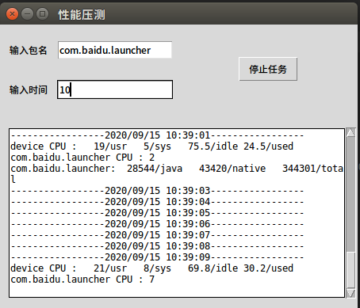
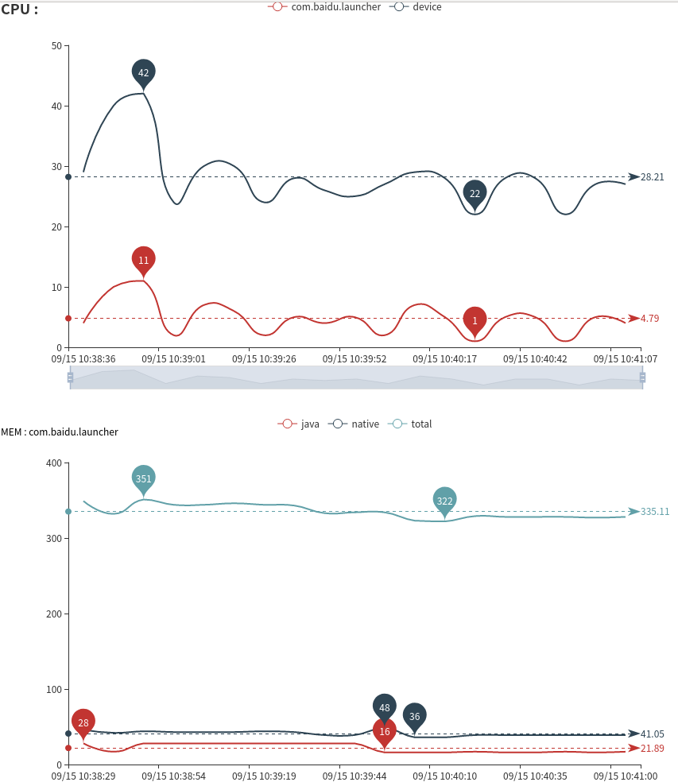

# PythonAndroidPresureTest

1. 该项目需运行在python3.6或以上环境

2. 安装pip(注意要只想python3.6或以上路径):
    https://www.runoob.com/w3cnote/python-pip-install-usage.html
    
    `pip 20.2.2 from /home/xx/.local/lib/python3.6/site-packages/pip (python 3.6)`
3. 安装python依赖模块:

    `pip install -r requirements.txt `
    
4. 运行项目:
    python3 main.py
    
5. 输入包名和压测时间:

    `需要监听多个进程用" | "隔开,例:com.baidu.launcher|com.qiyi.video.speaker`
    
    `数据监听时间单位分钟`
6. 点击开始监控

    
    
7. 压测完成后查看结果

    